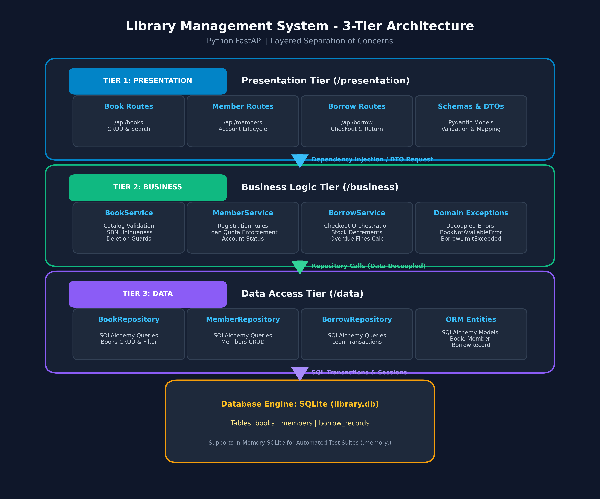

# Library Management System (3-Tier Architecture)

A robust, enterprise-grade **Library Management System** built with **Python FastAPI**, strictly structured using the **3-Tier (N-Tier) Architectural Pattern**.

[](https://www.python.org/downloads/)
[](https://fastapi.tiangolo.com)
[](https://www.sqlalchemy.org/)
[]()

---

## Table of Contents

- [Architectural Overview](#architectural-overview)
- [Project Directory Structure](#project-directory-structure)
- [Architecture Diagram](#architecture-diagram)
- [Tech Stack](#tech-stack)
- [Getting Started](#getting-started)
  - [Prerequisites](#prerequisites)
  - [Installation](#installation)
  - [Running the Application](#running-the-application)
- [API Documentation & Endpoints](#api-documentation--endpoints)
- [Core Business Rules](#core-business-rules)
- [Running Automated Tests](#running-automated-tests)
- [Submission Compliance](#submission-compliance)

---

## Architectural Overview

The application strictly decouples concerns across three distinct layers:

```text
+-------------------------------------------------------------------------+
|                  1. PRESENTATION TIER (/presentation)                   |
|  * FastAPI REST API Routers (/api/books, /api/members, /api/borrow)     |
|  * Pydantic DTO Request/Response Schemas & Validation                   |
|  * HTTP Status Code & Exception Mapping (400, 404, 409)                 |
+------------------------------------+------------------------------------+
                                     | Calls Service Methods
                                     v
+-------------------------------------------------------------------------+
|                     2. BUSINESS TIER (/business)                        |
|  * Domain Services (BookService, MemberService, BorrowService)          |
|  * Business Rules (Limits, Quotas, Stock Validation, Late Fines)       |
|  * Decoupled Domain Exceptions (Framework Independent)                  |
+------------------------------------+------------------------------------+
                                     | Uses Repositories
                                     v
+-------------------------------------------------------------------------+
|                        3. DATA TIER (/data)                             |
|  * Repository Pattern (BookRepository, MemberRepository, etc.)          |
|  * SQLAlchemy ORM Entity Models (Book, Member, BorrowRecord)            |
|  * Database Engine & Session Management (SQLite / PostgreSQL)           |
+------------------------------------+------------------------------------+
                                     | SQL / Persistence
                                     v
+-------------------------------------------------------------------------+
|                         SQLITE DATABASE ENGINE                          |
+-------------------------------------------------------------------------+
```

1. **Presentation Tier (`/presentation`)**:
   - Manages client interactions, deserializes request payloads, serializes responses, and routes HTTP requests.
   - Converts domain-level business exceptions into clean RESTful HTTP status codes (e.g., `404 Not Found`, `409 Conflict`, `400 Bad Request`).

2. **Business Tier (`/business`)**:
   - Contains all core business policies, domain constraints, and workflow coordination.
   - Independent of HTTP libraries and UI concerns.
   - Enforces inventory checks, active borrowing quotas, return deadlines, and overdue fines calculations.

3. **Data Tier (`/data`)**:
   - Isolates all database operations using the **Repository Pattern**.
   - Handles SQLAlchemy ORM mappings, transaction sessions, and persistent SQLite storage.

---

## Project Directory Structure

```text
Library_Management/
├── presentation/                 # TIER 1: Presentation Layer
│   ├── __init__.py
│   ├── main.py                   # FastAPI Application & Global Exception Handlers
│   ├── schemas.py                # Pydantic DTOs for Request / Response
│   └── routes/                   # API Route Controllers
│       ├── __init__.py
│       ├── book_routes.py        # /api/books endpoints
│       ├── member_routes.py      # /api/members endpoints
│       └── borrow_routes.py      # /api/borrow & /api/borrow/return endpoints
│
├── business/                     # TIER 2: Business Logic Layer
│   ├── __init__.py
│   ├── exceptions.py             # Domain-specific Exceptions
│   └── services/                 # Business Services
│       ├── __init__.py
│       ├── book_service.py       # Catalog Rules & Inventory Logic
│       ├── member_service.py     # Membership Quotas & Validation
│       └── borrow_service.py     # Checkout, Return, & Fine Calculations
│
├── data/                         # TIER 3: Data Access Layer
│   ├── __init__.py
│   ├── database.py               # Engine, Base, & SessionLocal setup
│   ├── models.py                 # SQLAlchemy ORM Entities (Book, Member, BorrowRecord)
│   └── repositories/             # Repository Pattern
│       ├── __init__.py
│       ├── book_repository.py    # CRUD & Filter Queries for Books
│       ├── member_repository.py  # CRUD Queries for Members
│       └── borrow_repository.py  # CRUD Queries for Borrow Records
│
├── tests/                        # Automated Tests Layer
│   ├── __init__.py
│   ├── conftest.py               # In-Memory SQLite Fixture & TestClient
│   ├── test_data_layer.py        # Data Tier Repositories Unit Tests
│   ├── test_business_layer.py    # Business Tier Services & Rules Unit Tests
│   └── test_presentation_layer.py# Presentation Tier API Integration Tests
│
├── architecture_diagram.md       # Detailed Architecture Specification & Mermaid Diagrams
├── architecture_diagram.png      # Visual Architecture Diagram
├── requirements.txt              # Project Dependencies
├── run.py                        # Application Startup Launcher
└── README.md                     # Documentation
```

---

## Architecture Diagram

The architecture is documented in [architecture_diagram.md](architecture_diagram.md) and visually depicted below:



---

## Tech Stack

- **Language**: Python 3.10+
- **Web Framework**: FastAPI (High performance, OpenAPI/Swagger support)
- **ASGI Server**: Uvicorn
- **ORM & Database**: SQLAlchemy 2.0+ with SQLite (Persistent `library.db` or In-Memory `:memory:`)
- **Validation**: Pydantic v2
- **Testing**: Pytest & HTTPX TestClient

---

## Getting Started

### Prerequisites

- Python 3.10 or higher installed.

### Installation

1. **Clone the repository**:
   ```bash
   git clone https://github.com/YashasviJadav03/Library_Management.git
   cd Library_Management
   ```

2. **Create and activate a virtual environment**:
   - **Windows (PowerShell)**:
     ```powershell
     python -m venv venv
     .\venv\Scripts\Activate.ps1
     ```
   - **Linux / macOS**:
     ```bash
     python -m venv venv
     source venv/bin/activate
     ```

3. **Install dependencies**:
   ```bash
   pip install -r requirements.txt
   ```

### Running the Application

Launch the server using the entry point runner:
```bash
python run.py
```

The application will start on `http://127.0.0.1:8000`.

- **Interactive Swagger UI**: [http://127.0.0.1:8000/docs](http://127.0.0.1:8000/docs)
- **ReDoc UI**: [http://127.0.0.1:8000/redoc](http://127.0.0.1:8000/redoc)
- **Health Check**: [http://127.0.0.1:8000/health](http://127.0.0.1:8000/health)

---

## API Documentation & Endpoints

### 1. Catalog / Books (`/api/books`)

| Method | Endpoint | Description | Status Code |
|---|---|---|---|
| `POST` | `/api/books/` | Add a new book to the catalog | `201 Created` |
| `GET` | `/api/books/` | List books (supports `search`, `category`, pagination) | `200 OK` |
| `GET` | `/api/books/{id}` | Get book details by ID | `200 OK` |
| `PUT` | `/api/books/{id}` | Update book information / copies count | `200 OK` |
| `DELETE` | `/api/books/{id}` | Delete book (forbidden if copies currently loaned) | `200 OK` |

### 2. Members (`/api/members`)

| Method | Endpoint | Description | Status Code |
|---|---|---|---|
| `POST` | `/api/members/` | Register a new library member | `201 Created` |
| `GET` | `/api/members/` | List members with pagination | `200 OK` |
| `GET` | `/api/members/{id}` | Retrieve member profile | `200 OK` |
| `PUT` | `/api/members/{id}` | Update member profile / tier / status | `200 OK` |
| `DELETE` | `/api/members/{id}` | Remove member (forbidden if active loans exist) | `200 OK` |
| `GET` | `/api/members/{id}/active-loans` | View all active borrowings of a member | `200 OK` |

### 3. Borrowing & Returns (`/api/borrow`)

| Method | Endpoint | Description | Status Code |
|---|---|---|---|
| `POST` | `/api/borrow/` | Checkout a book for a member | `201 Created` |
| `POST` | `/api/borrow/return/{record_id}` | Return book (auto-calculates late fine if overdue) | `200 OK` |
| `GET` | `/api/borrow/records` | Query borrow transactions (filter by member/book/status) | `200 OK` |
| `GET` | `/api/borrow/records/{record_id}` | Retrieve specific borrow transaction details | `200 OK` |

---

## Core Business Rules

1. **Inventory & Availability**:
   - Initial `available_copies` equals `total_copies`.
   - Checkout is rejected if `available_copies <= 0` (`BookNotAvailableError` -> HTTP 400).
   - Available copies are automatically decremented on borrow and incremented on return.
   - Total copies cannot be reduced below currently borrowed copy count.
   - Books with active loans cannot be deleted (`BookHasActiveLoansError` -> HTTP 400).

2. **Membership Limits**:
   - `STUDENT`: Default maximum of **3** concurrent books.
   - `FACULTY`: Default maximum of **10** concurrent books.
   - `GENERAL`: Default maximum of **2** concurrent books.
   - Active borrows are validated before checkout; exceeds limit raises `BorrowLimitExceededError` (HTTP 400).
   - Inactive accounts cannot borrow books (`MemberInactiveError` -> HTTP 400).
   - Members with unreturned books cannot be deactivated or deleted.

3. **Due Dates & Late Fines**:
   - Default borrowing window is **14 days** (customizable per checkout).
   - Overdue calculation: `overdue_days = (return_date - due_date).days`.
   - Late fee rate is **$1.00 / day** overdue.
   - Returns on or before due date accrue **$0.00** in fines.

---

## Running Automated Tests

A comprehensive test suite is included in `/tests` covering all three tiers:
- **Data Tier**: Tests repository CRUD operations and database constraints.
- **Business Tier**: Tests domain policies, limits, stock checks, and fine calculations.
- **Presentation Tier**: Tests FastAPI HTTP routing, status codes, and JSON serialization.

Run the test suite:
```bash
python -m pytest -v tests/
```

### Test Results Output:
```text
tests/test_business_layer.py::TestBookService::test_add_book_success PASSED
tests/test_business_layer.py::TestBookService::test_add_duplicate_isbn_raises PASSED
tests/test_business_layer.py::TestBookService::test_add_book_invalid_copies_raises PASSED
tests/test_business_layer.py::TestBookService::test_cannot_delete_book_with_active_loans PASSED
tests/test_business_layer.py::TestMemberService::test_register_member_success PASSED
tests/test_business_layer.py::TestMemberService::test_register_duplicate_email_raises PASSED
tests/test_business_layer.py::TestMemberService::test_invalid_email_raises PASSED
tests/test_business_layer.py::TestMemberService::test_cannot_deactivate_member_with_active_loans PASSED
tests/test_business_layer.py::TestBorrowService::test_borrow_success_decrements_copies PASSED
tests/test_business_layer.py::TestBorrowService::test_borrow_zero_copies_raises PASSED
tests/test_business_layer.py::TestBorrowService::test_borrow_exceeds_limit_raises PASSED
tests/test_business_layer.py::TestBorrowService::test_return_book_on_time_zero_fine PASSED
tests/test_business_layer.py::TestBorrowService::test_return_book_overdue_calculates_fine PASSED
tests/test_business_layer.py::TestBorrowService::test_return_already_returned_raises PASSED
tests/test_data_layer.py::TestBookRepository::test_add_and_get_book PASSED
tests/test_data_layer.py::TestBookRepository::test_list_books_search PASSED
tests/test_data_layer.py::TestBookRepository::test_delete_book PASSED
tests/test_data_layer.py::TestMemberRepository::test_add_and_get_member PASSED
tests/test_data_layer.py::TestMemberRepository::test_update_member PASSED
tests/test_data_layer.py::TestBorrowRepository::test_borrow_record_lifecycle PASSED
tests/test_presentation_layer.py::TestPresentationLayer::test_root_and_health PASSED
tests/test_presentation_layer.py::TestPresentationLayer::test_book_crud_endpoints PASSED
tests/test_presentation_layer.py::TestPresentationLayer::test_member_crud_endpoints PASSED
tests/test_presentation_layer.py::TestPresentationLayer::test_borrow_and_return_endpoints PASSED

======================== 24 passed in 1.62s ========================
```

---

## Submission Compliance

| Required Element | Implementation in Repository | Status |
|---|---|---|
| `/presentation` folder | [presentation/](presentation/) containing routes, schemas, and main FastAPI app | Completed |
| `/business` folder | [business/](business/) containing domain services, policies, and domain exceptions | Completed |
| `/data` folder | [data/](data/) containing SQLAlchemy models, database session, and repositories | Completed |
| `/tests` folder | [tests/](tests/) with 24 unit & integration tests covering all 3 tiers | Completed |
| `README.md` | Comprehensive setup, architecture, and API documentation | Completed |
| Architecture diagram | [architecture_diagram.md](architecture_diagram.md) and [architecture_diagram.png](architecture_diagram.png) | Completed |
| Tech Stack | Python 3.10+ and FastAPI | Completed |