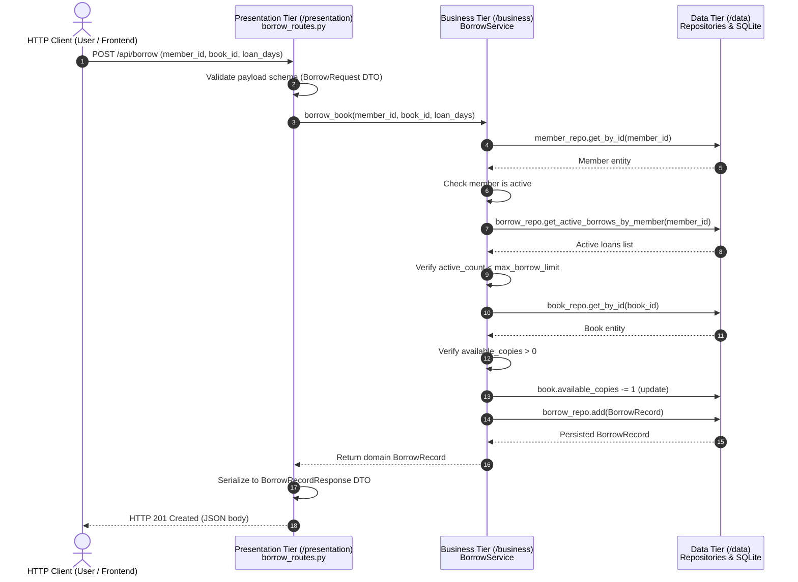
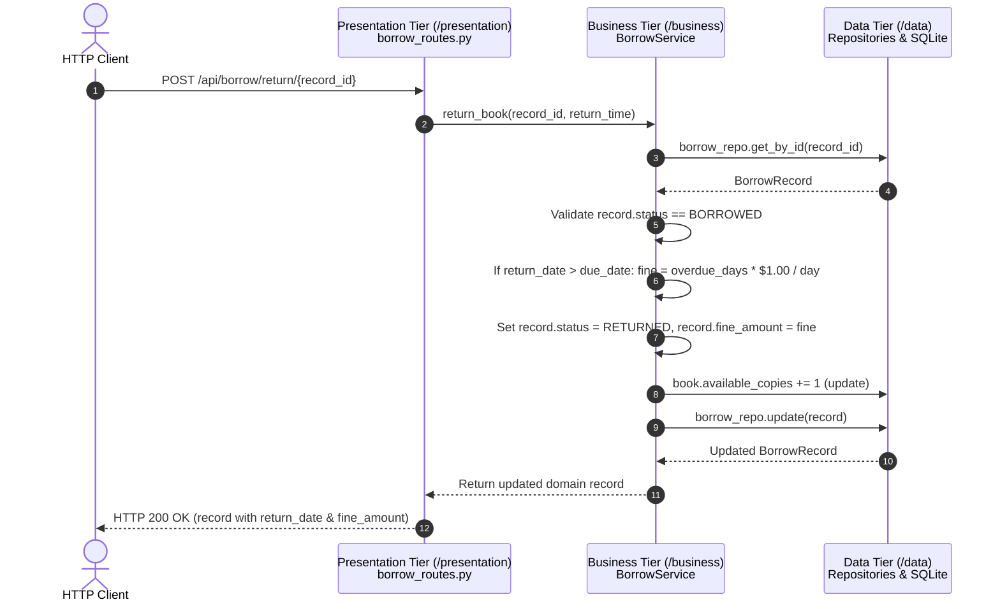

# Architecture Diagram & Design Document

## 1. 3-Tier Architectural Overview

The **Library Management System** is designed strictly adhering to the classic **3-Tier / N-Tier Architecture** pattern. This enforces loose coupling, high cohesion, clear separation of concerns, and ease of maintainability.

```
+-----------------------------------------------------------------------------+
|                           PRESENTATION TIER (/presentation)                 |
|                                                                             |
|  +--------------------+   +----------------------+   +-------------------+  |
|  |  Book API Routes   |   |  Member API Routes   |   | Borrow API Routes |  |
|  |  (/api/books)      |   |  (/api/members)      |   | (/api/borrow)     |  |
|  +---------+----------+   +----------+-----------+   +---------+---------+  |
|            |                         |                         |            |
|            +-------------------------+-------------------------+            |
|                                      |                                      |
|                  Request Validation & Serialization (Pydantic DTOs)         |
|                  HTTP Exception Mapping & Status Codes (400, 404, 409)      |
+--------------------------------------|--------------------------------------+
                                       | Dependency Injection (Calls Service API)
                                       v
+-----------------------------------------------------------------------------+
|                            BUSINESS TIER (/business)                        |
|                                                                             |
|  +--------------------+   +----------------------+   +-------------------+  |
|  |    BookService     |   |    MemberService     |   |   BorrowService   |  |
|  +--------------------+   +----------------------+   +-------------------+  |
|  * ISBN Uniqueness        * Email Validation         * Checkout Limit Rule  |
|  * Catalog Constraints    * Membership Tier Quotas   * Stock Decrement      |
|  * Active Loan Checks     * Account Lifecycle        * Late Fee Fine Calc   |
|                                                                             |
|  Domain Exceptions: LibraryDomainException, BookNotAvailableError, etc.      |
+--------------------------------------|--------------------------------------+
                                       | Uses Repositories (ORM Independent)
                                       v
+-----------------------------------------------------------------------------+
|                              DATA TIER (/data)                              |
|                                                                             |
|  +--------------------+   +----------------------+   +-------------------+  |
|  |   BookRepository   |   |   MemberRepository   |   | BorrowRepository  |  |
|  +---------+----------+   +----------+-----------+   +---------+---------+  |
|            |                         |                         |            |
|  +---------v----------+   +----------v-----------+   +---------v---------+  |
|  |     Book Model     |   |     Member Model     |   | BorrowRecord Model|  |
|  +--------------------+   +----------------------+   +-------------------+  |
|                                                                             |
|               SQLAlchemy Session Management / Connection Engine             |
+--------------------------------------|--------------------------------------+
                                       | SQL / Transactions
                                       v
+-----------------------------------------------------------------------------+
|                               DATABASE ENGINE                               |
|                                 SQLite (.db)                                |
+-----------------------------------------------------------------------------+
```

---

## 2. Layer Responsibilities & Isolation Rules

| Layer | Directory | Responsibilities | Inbound Dependencies | Outbound Dependencies |
|---|---|---|---|---|
| **Presentation Tier** | `/presentation` | HTTP REST endpoints, URL routing, query parsing, request/response validation (Pydantic), error status code mapping | External HTTP Clients / Browsers | Business Services |
| **Business Tier** | `/business` | Domain logic, validation rules (limits, due dates, fines), workflow orchestration, pure Python domain exceptions | Presentation Tier | Data Repositories & Models |
| **Data Tier** | `/data` | Database connectivity, SQLAlchemy ORM entities, SQL persistence, transactional CRUD queries (Repository Pattern) | Business Tier | SQLite Database |

---

## 3. Transaction Workflow: Book Checkout (Borrow)



---

## 4. Transaction Workflow: Book Return & Fine Calculation



---

## 5. Architectural Isolation Highlights

1. **Independent Testing**: Each tier is unit tested in isolation (`test_data_layer.py`, `test_business_layer.py`, `test_presentation_layer.py`).
2. **Framework Agnostic Business Rules**: The business services do not import `fastapi` or `Request`/`Response` objects. If the presentation tier changes (e.g. CLI, gRPC, GraphQL), the business tier remains untouched.
3. **Database Independence**: The repository abstraction decouples the storage implementation from business consumers.
